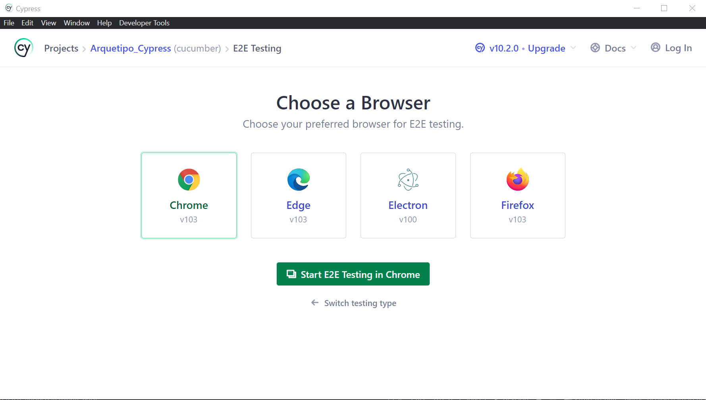

# cypress-tests

# Install Cypress and Allure
```
npm install cypress@10.2.0 --save-dev
npm i -D @shelex/cypress-allure-plugin

```

# Run


```
.\node_modules\.bin\cypress open --config-file cypress-pro.config.ts --env allure=true,allureResultsPath=cypress/allure_results

O si quieres que te saque un reporte en linea de comandos y tambien video se puede ejecutar asi:
npx cypress run --env allure=true,allureResultsPath=cypress/allure_results
```

# Execute test with GUI

1. Select e2e testing


2. Select browser, in this case Chrome

   
3. Finally run test that we want to execute

